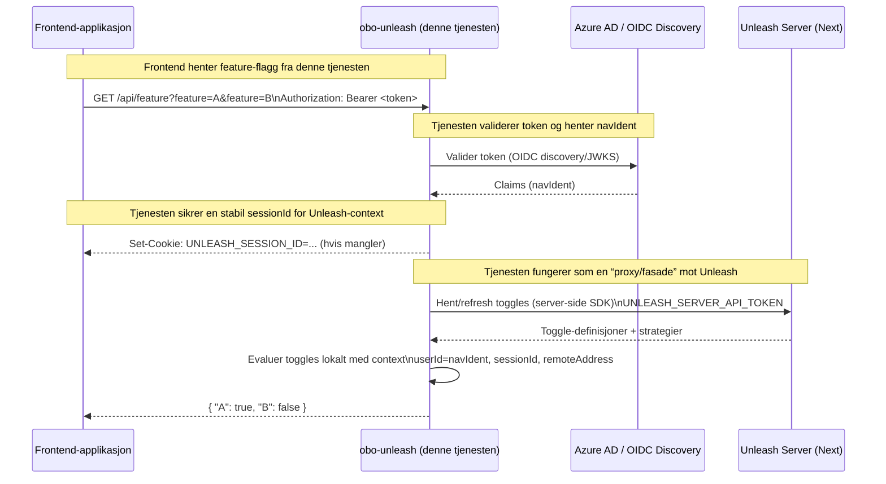

# obo-unleash

Tjeneste for å gjøre kall mot Unleash Next med tilpassede strategier.

_Forket fra [poao-unleash](https://github.com/navikt/poao-unleash)._

## Strategier
Tjenesten støtter følgende strategier

### byCluster
byCluster-strategien kan brukes for å skru på funksjonalitet for et gitt cluster. Feks. `dev-gcp`

### userWithId
userWithId-strategien kan brukes for å gi en eller flere brukeridenter tilgang til funksjonalitet.

### byEnhetAndEnvironment
byEnhetAndEnvironment-strategien brukes for å skru på funksjonalitet for en gitt enhet med `fagområdet/tema = oppfølging (OPP)`. Feks vil verdien 0106 skru på funksjonalitet for alle i Nav-enheten Fredrikstad som har fagområdet `OPP` (oppfølging), men med mulighet for å skru av i produksjon. På den måten kan man teste enheten i dev før man skrur på i produksjon.

### byEnhet
byEnhet-strategien brukes for å skru på funksjonalitet for en gitt enhet med `fagområdet/tema = oppfølging (OPP)`. Feks vil verdien 0106 skru på funksjonalitet for alle i Nav-enheten Fredrikstad som har fagområdet `OPP` (oppfølging).

## Arkitektur

## Kode generert av GitHub Copilot

Dette repoet bruker GitHub Copilot til å generere kode.
